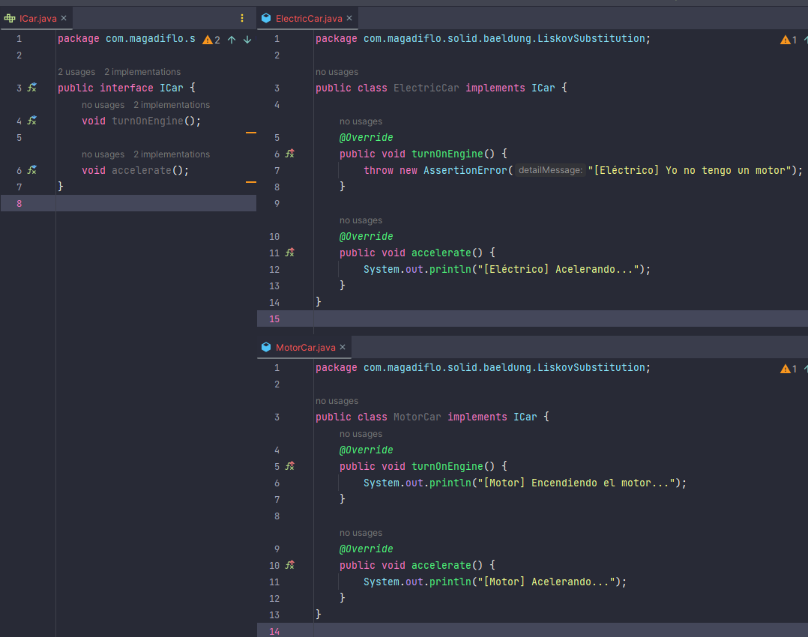
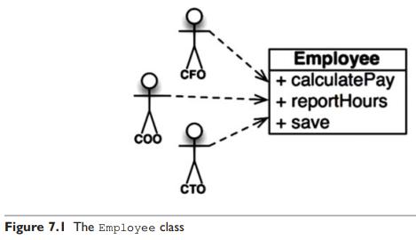
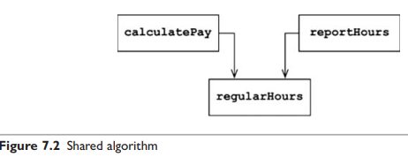
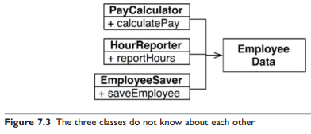
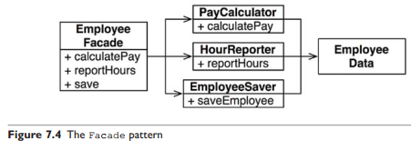
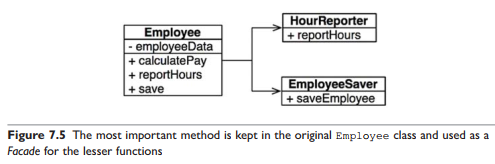
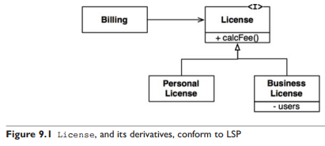
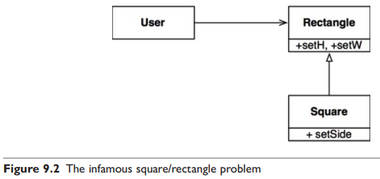
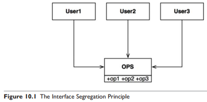
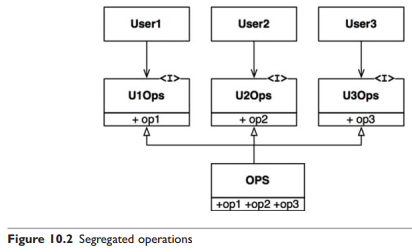

# Principios SOLID

En este proyecto tomaré ejemplos de varios artículos en la web que hablen sobre este principio.

---

## [Baeldung](https://www.baeldung.com/solid-principles)

Los principios SOLID fueron introducidos por Robert C. Martin en su artículo de 2000 "Design Principles and Design
Patterns". Estos conceptos fueron construidos más tarde por Michael Feathers, quien nos presentó el acrónimo SOLID. Y en
los últimos 20 años, estos cinco principios han revolucionado el mundo de la programación orientada a objetos, cambiando
la forma en que escribimos software.

Entonces, ¿qué es SOLID y cómo nos ayuda a escribir mejor código? En pocas palabras, los principios de diseño de Martin
y Feathers **nos animan a crear un software más fácil de mantener, comprensible y flexible.** En consecuencia, **a
medida que nuestras aplicaciones crecen en tamaño, podemos reducir su complejidad** y ahorrarnos muchos dolores de
cabeza más adelante.

Los siguientes cinco conceptos conforman nuestros principios SOLID:

1. **S**ingle Responsibility
   > El principio de responsabilidad única establece que **una clase solo debe tener una responsabilidad. Además, solo
   debería tener una razón para cambiar**.

2. **O**pen/Closed
   > El principio de abierto/cerrado establece que **las clases deben estar abiertas para la extensión pero cerradas
   para la modificación**. Al hacerlo, nos detenemos de modificar el código existente y causar nuevos errores
   potenciales en una aplicación feliz. Por supuesto, **la única excepción a la regla es cuando se corrigen errores en
   el código existente.**

3. **L**iskov Substitution
   > Esto significa que **cada subclase o clase derivada debe ser sustituible por su clase base o padre.** En pocas
   palabras, **si la clase A es un subtipo de clase B, deberíamos poder reemplazar B con A sin interrumpir el
   comportamiento de nuestro programa.**

   **Veamos la violación de este principio:**



Al incluir un automóvil sin motor en la mezcla, estamos cambiando inherentemente el comportamiento de nuestro programa.
**Esta es una violación flagrante de la sustitución de Liskov y es un poco más difícil de arreglar que nuestros dos
principios anteriores.**

Una posible solución sería volver a trabajar nuestro modelo en interfaces que tengan en cuenta el estado sin motor de
nuestro automóvil.

4. **I**nterface Segregation
   > Significa que **las interfaces más grandes deben dividirse en otras más pequeñas. Al hacerlo, podemos asegurarnos
   de que las clases de implementación solo deben preocuparse por los métodos que les interesan.**

5. **D**ependency Inversion
   > **Los componentes deben depender de abstracciones, no de concreciones.** Se refiere al desacoplamiento de los
   módulos de software. De esta manera, en lugar de módulos de alto nivel dependiendo de módulos de bajo nivel, ambos
   dependerán de abstracciones.

---

## [Libro: Clean Architecture - Robert C. Martin](https://github.com/sdcuike/Clean-Code-Collection-Books/blob/master/Clean.Architecture.2017.9.pdf)

## Principios de Diseño SOLID

**Resumen:**

- **SRP:** The Single Responsibility Principle  
  Cada módulo de software tiene una, y solo una, razón para cambiar.


- **OCP:** The Open-Closed Principle  
  Los sistemas de software deben estar diseñados para permitir que el comportamiento de esos sistemas cambie agregando
  código nuevo, en lugar de cambiar el código existente.


- **LSP:** The Liskov Substitution Principle  
  Este principio dice que para construir sistemas de software a partir de partes intercambiables, esas partes deben
  adherirse a un contrato que permite que esas partes se sustituyan entre sí.


- **ISP:** The Interface Segregation Principle  
  Este principio aconseja a los diseñadores de software que eviten depender de cosas que no usan.


- **DIP:** The Dependency Inversion Principle  
  El código que implementa la política de alto nivel no debe depender del código que implementa los detalles de bajo
  nivel. Más bien, los detalles deberían depender de las políticas.

## SRP: The Single Responsibility Principle

Es demasiado fácil para los programadores escuchar el nombre y luego asumir que *significa que cada módulo debe hacer
una sola cosa.*

**¡No se equivoquen!**, hay un principio como ese. *Una función debe hacer una y solo una cosa.* Usamos ese principio
cuando estamos refactorizando funciones grandes en funciones más pequeñas; lo usamos en los niveles más
bajos. ``Pero no es uno de los principios SOLID, no es el SRP.``

Históricamente, el SRP se ha descrito de esta manera:

> Un módulo debe tener una, y solo una, razón para cambiar.

Los usuarios y stakeholders son la “razón para cambiar” de la que habla el principio. De hecho, podemos reformular
el principio para decir esto:

> Un módulo debe ser responsable ante uno, y solo uno, usuario o stakeholder.

Es probable que haya más de un usuario o stakeholder que desee que el sistema cambie de la misma manera. Por lo tanto,
nos referiremos a ellos como un grupo: una o más personas que requieren ese cambio. **Nos referiremos a ese grupo como
un actor.**

Así, la **versión final del SRP es:**

> **Un módulo debe ser responsable ante uno y solo un actor**

Ahora bien, **¿a qué nos referimos con la palabra "módulo"?** La definición más simple es solo un archivo fuente. La
mayoría de las veces esa definición funciona bien. Sin embargo, algunos lenguajes y entornos de desarrollo no usan
archivos fuente para contener su código. En esos casos, un módulo es solo un conjunto cohesivo de funciones y
estructuras de datos.

Esa palabra "cohesivo" implica el SRP. **La cohesión es la fuerza que une el código responsable de un solo actor.**

Quizás **la mejor manera de entender este principio es observar los síntomas de su violación.**

### Síntoma 1: duplicación accidental

Mi ejemplo favorito es la clase Employee de una aplicación de nómina. Tiene tres métodos: **calcularPago(),
reportarHoras() y guardar()** (Figura 7.1).



``Esta clase viola el SRP porque esos tres métodos son responsables ante tres actores muy diferentes.``

- El método de **calculatePay()** lo especifica el departamento de contabilidad, que **informa al CFO.**
- El método **reportHours()** es especificado y utilizado por el departamento de recursos humanos, que **informa al
  COO.**
- El método **save()** lo especifican los administradores de la base de datos (DBA), quienes **reportan al CTO.**

Al colocar el código fuente de estos tres métodos en una sola clase de empleado, los desarrolladores han acoplado cada
uno de estos actores con los demás. Este acoplamiento puede hacer que las acciones del equipo del CFO afecten algo de lo
que depende el equipo del COO.

Por ejemplo, suponga que la función calculatePay() y la función reportHours() comparten un algoritmo común para
calcular las horas no extra. Suponga también que los desarrolladores, que tienen cuidado de no duplicar el código,
colocan ese algoritmo en una función llamada reportHours() (Figura 7.2)



Ahora suponga que el equipo del CFO decide que la forma en que se calculan las horas que no son horas extra debe
modificarse. Por el contrario, el equipo de RR. HH. del director de operaciones no quiere ese ajuste en particular
porque utilizan horas que no son horas extra para un propósito diferente.

Un desarrollador tiene la tarea de realizar el cambio y ve la conveniente función regularHours() llamada por el método
calculatePay(). Desafortunadamente, ese desarrollador no se da cuenta de que la función reportHours() también llama a la
función.

El desarrollador realiza el cambio requerido y lo prueba cuidadosamente. El equipo del CFO valida que la nueva función
funcione como se desea y se implementa el sistema.

Por supuesto, el equipo del COO no sabe que esto está sucediendo. El personal de recursos humanos sigue utilizando los
informes generados por la función reportHours(), pero ahora contienen números incorrectos. Finalmente, se descubre el
problema y el director de operaciones está furioso porque los datos erróneos le han costado a su presupuesto millones de
dólares.

Todos hemos visto cosas como esta suceder. Estos problemas ocurren porque **ponemos código del que dependen diferentes
actores muy cerca.** ``El SRP dice que separe el código del que dependen los diferentes actores.``

### Síntoma 1: fusiones

No es difícil imaginar que las fusiones serán comunes en los archivos de origen que contienen muchos métodos diferentes.
Esta situación es especialmente probable si esos métodos son responsables de diferentes actores.

Por ejemplo, suponga que el equipo de DBA del CTO decide que debe haber un cambio de esquema simple en la tabla Empleado
de la base de datos. Suponga también que el equipo de empleados de recursos humanos del director de operaciones decide
que necesita un cambio en el formato del informe de horas.

Dos desarrolladores diferentes, posiblemente de dos equipos diferentes, verifican la clase Empleado y comienzan a
realizar cambios. Desafortunadamente, sus cambios chocan. El resultado es una fusión.

Probablemente, no necesito decirte que las fusiones son asuntos riesgosos. Nuestras herramientas son bastante buenas hoy
en día, pero ninguna herramienta puede manejar todos los casos de fusión. Al final, siempre hay riesgo.

En nuestro ejemplo, la fusión pone en riesgo tanto al CTO como al COO. No es inconcebible que el CFO también pueda verse
afectado.

Hay muchos otros síntomas que podríamos investigar, pero todos involucran a varias personas que cambian el mismo archivo
de origen por diferentes motivos.

Una vez más, **la forma de evitar este problema es separar el código que admite diferentes actores.**

### Soluciones

Hay muchas soluciones diferentes para este problema. Cada uno mueve las funciones a diferentes clases.

Quizás la forma más obvia de resolver el problema es separar los datos de las funciones. Las tres clases comparten
acceso a EmployeeData, que es una estructura de datos simple sin métodos (Figura 7.3). Cada clase contiene solo el
código fuente necesario para su función particular. No se permite que las tres clases se conozcan entre sí. Así se evita
cualquier duplicación accidental.



La desventaja de esta solución es que los desarrolladores ahora tienen tres clases que deben instanciar y rastrear. Una
solución común a este dilema es usar el patrón Fachada (Figura 7.4)



El EmployeeFacade contiene muy poco código. Es responsable de instanciar y delegar a las clases con las funciones.

Algunos desarrolladores prefieren mantener las reglas comerciales más importantes más cerca de los datos. Esto se puede
hacer manteniendo el método más importante en la clase Empleado original y luego usando esa clase como una Fachada para
las funciones menores (Figura 7.5).



Puede objetar estas soluciones sobre la base de que cada clase contendría solo una función. Este no es el caso. Es
probable que la cantidad de funciones requeridas para calcular el pago, generar un informe o guardar los datos sea
grande en cada caso. Cada una de esas clases tendría muchos métodos privados en ellas.

Cada una de las clases que contienen tal familia de métodos es un alcance. Fuera de ese ámbito, nadie sabe que existen
los miembros privados de la familia.

### CONCLUSIÓN

El principio de responsabilidad única se trata de funciones y clases, pero reaparece en una forma diferente en dos
niveles más. A nivel de componentes, se convierte en el Principio de Cierre Común. A nivel arquitectónico, se convierte
en el Eje de Cambio responsable de la creación de Límites Arquitectónicos.

## OCP: The Open-Closed Principle

> Un artefacto de software debe estar **abierto para extensión pero cerrado para modificación.**

En otras palabras, el comportamiento de un artefacto de software debería ser extensible, sin tener que modificar ese
artefacto.

### CONCLUSIÓN

El objetivo es hacer que el sistema sea fácil de extender sin incurrir en un alto impacto de cambio. Este objetivo se
logra dividiendo el sistema en componentes y organizando esos componentes en una jerarquía de dependencia que protege
los componentes de nivel superior de los cambios en los componentes de nivel inferior.

## LSP: The Liskov Substitution Principle

Para entender esta idea, que se conoce como Principio de Sustitución de Liskov (LSP), veamos algunos ejemplos.

### Guía del uso de la herencia

Imagine que tenemos una clase llamada Licencia, como se muestra en la Figura 9.1. Esta clase tiene un método denominado
calcFee(), al que llama la aplicación Billing (Facturación). Hay dos "subtipos" de Licencia: PersonalLicense y
BusinessLicense. Utilizan diferentes algoritmos para calcular la tarifa de la licencia.



**Este diseño se ajusta al LSP** porque el comportamiento de la aplicación Billing (Facturación) no depende, en modo
alguno, de cuál de los dos subtipos utilice. Ambos subtipos son sustituibles por el tipo de Licencia.

### El problema del cuadrado/rectángulo

El ejemplo canónico de una violación del LSP es el famoso problema cuadrado/rectángulo (Figura 9.2).



En este ejemplo, Square no es un subtipo adecuado de Rectangle porque la altura y el ancho de Rectangle son mutables de
forma independiente; en contraste, la altura y el ancho del Cuadrado deben cambiar juntos. Dado que el Usuario cree que
se está comunicando con un Rectángulo, podría confundirse fácilmente. El siguiente código muestra por qué:

````
Rectangle r = …
r.setW(5);
r.setH(2);
assert(r.area() == 10);
If the … code produced a Square, then the assertion would fail.
````

La única forma de defenderse contra este tipo de violación de LSP es agregar mecanismos al Usuario (como una declaración
if) que detecte si el Rectángulo es, de hecho, un Cuadrado. Dado que el comportamiento del Usuario depende de los tipos
que utiliza, dichos tipos no son sustituibles.

### CONCLUSIÓN

El LSP puede y debe extenderse al nivel de la arquitectura. Una simple violación de la sustituibilidad puede causar que
la arquitectura de un sistema se contamine con una cantidad significativa de mecanismos adicionales

## ISP: The Interface Segregation Principle

El Principio de Segregación de Interfaz (ISP) deriva su nombre del diagrama que se muestra en la Figura 10.1.



En la situación ilustrada en la Figura 10.1, hay varios usuarios que utilizan las operaciones de la clase OPS.
Supongamos que User1 usa solo op1, User2 usa solo op2 y User3 usa solo op3.

Ahora imagina que OPS es una clase escrita en un lenguaje como Java. Claramente, en ese caso, el código fuente del
Usuario1 dependerá inadvertidamente de op2 y op3, aunque no los llame. Esta dependencia significa que un cambio en el
código fuente de op2 en OPS forzará a User1 a ser recompilado y reimplementado, aunque nada de lo que le importaba
realmente haya cambiado.

Este problema **se puede resolver segregando las operaciones en interfaces** como se muestra en la Figura 10.2.

Nuevamente, si imaginamos que esto se implementa en un lenguaje de tipo estático como Java, entonces el código fuente de
User1 dependerá de U1Ops y op1, pero no dependerá de OPS. Por lo tanto, un cambio en OPS que no le importe al Usuario1
no hará que el Usuario1 sea recompilado y reimplementado.



